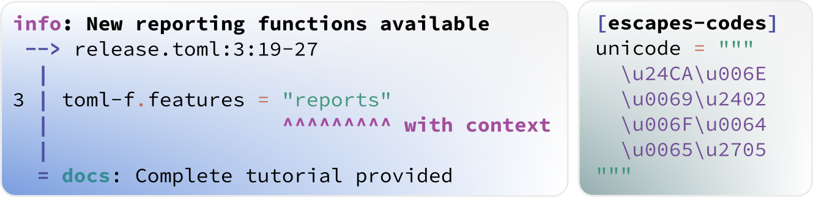

:author: Sebastian Ehlert
:date: 2022-08-01
:category: release
:excerpt: 1
:image: 1

TOML Fortran 0.3.0 released
===========================

This release comes with a new backend for the deserialization of TOML documents, making the parser more robust against unclosed inline tables and arrays.
Furthermore, a context can now be captured which allows reporting messages like errors as annotations in TOML document, making both the default errors produced by the parsers more useful and also enabling users of TOML Fortran to create consistently formatted reports.
Together with the refactoring of the internal representation for storing TOML values, the low-level interface to TOML values becomes more consistent and easier to use.
A long-standing issue with supporting Unicode escape sequences in strings has been resolved and TOML Fortran now fully supports all TOML 1.0.0 escape sequences.

The high-level interface to the TOML data structures has been extended to return origin information for each access, which can be used together with the context captured while parsing for better error reporting.
An additional set of interfaces was added allowing easier access to deeply nested values by internally transversing the data structure, rather than requiring the user to do it manually.
Similarly, whole arrays can now be retrieved directly into a one-dimensional allocatable array.

Many thanks to Kjell Jorner (`@kjelljorner <https://github.com/kjelljorner>`__), Emily Kahl (`@emilyviolet <https://github.com/emilyviolet>`__), Asdrubal Lozada-Blanco (`@aslozada <https://github.com/aslozada>`__) and Daniel Mejia-Rodriguez (`@dmejiar <https://github.com/dmejiar>`__) for contributing to this release.

.. admonition:: TOML Fortran is looking for support!
   :class: attention

   If you are interested in contributing to the project, please checkout the `repository <https://github/toml-f/toml-f>`__, or reach out in `toml-f#62 <https://github.com/toml-f/toml-f/issues/62>`__ to the current maintainer.

Full changelog
--------------

Full commit history available at `v0.2.3...v0.3.0 <https://github.com/toml-f/toml-f/compare/v0.2.3...v0.3.0>`__.
For release artifacts, like source distributions, checkout `v0.3.0 <https://github.com/toml-f/toml-f/releases/tag/v0.3.0>`_.

Library changes
~~~~~~~~~~~~~~~

* Improve lexing and parsing of TOML documents
  (`toml-f#88 <https://github.com/toml-f/toml-f/pull/88>`__)
* Refactoring of internal storage and encoding structure
  (`toml-f#93 <https://github.com/toml-f/toml-f/pull/93>`__)
* Allow choice of merge policy and remove context from merged data
  (`toml-f#94 <https://github.com/toml-f/toml-f/pull/94>`__)
* Support for Unicode escape sequences
  (`toml-f#100 <https://github.com/toml-f/toml-f/pull/100>`__)
* Allow fetching of nested values using a key path
  (`toml-f#104 <https://github.com/toml-f/toml-f/pull/104>`__)
* Add whole array setters and getters to build interface
  (`toml-f#79 <https://github.com/toml-f/toml-f/pull/79>`__)

Repository Maintenance
~~~~~~~~~~~~~~~~~~~~~~

* Use proper upstream for test-drive
  (`toml-f#58 <https://github.com/toml-f/toml-f/pull/58>`__)
* Update README, documentation workflow and validation suite
  (`toml-f#73 <https://github.com/toml-f/toml-f/pull/73>`__)
* Update install-mod.py to use python3
  (`toml-f#60 <https://github.com/toml-f/toml-f/pull/60>`__)
* Update CI workflow
  (`toml-f#87 <https://github.com/toml-f/toml-f/pull/87>`__)

Documentation Updates
~~~~~~~~~~~~~~~~~~~~~

* Add tutorial on creating a linter
  (`toml-f#88 <https://github.com/toml-f/toml-f/pull/88>`__)
* Add tutorial on writing a custom JSON lexer
  (`toml-f#93 <https://github.com/toml-f/toml-f/pull/93>`__)
* Update documentation
  (`toml-f#78 <https://github.com/toml-f/toml-f/pull/78>`__, `toml-f#80 <https://github.com/toml-f/toml-f/pull/80>`__)
* Add recipe for handling an array of tables
  (`toml-f#82 <https://github.com/toml-f/toml-f/pull/82>`__)
* Added recipe for reading elements of an array, with error checking
  (`toml-f#81 <https://github.com/toml-f/toml-f/pull/81>`__)
* Update German translation
  (`toml-f#95 <https://github.com/toml-f/toml-f/pull/95>`__)
* Spanish translation/Traducción al español
  (`toml-f#86 <https://github.com/toml-f/toml-f/pull/86>`__)
* Add recipe on date time compatibility with other libraries
  (`toml-f#103 <https://github.com/toml-f/toml-f/pull/103>`__)
